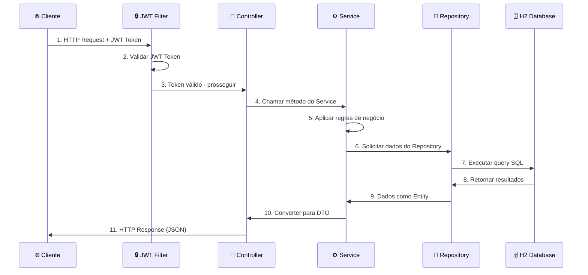

# 🏦 API de Investimentos Brasileira - Spring Boot

Uma API RESTful completa para gestão de investimentos com autenticação JWT, construída com **Spring Boot 3.2.2** e **Java 17**. 

**Sistema totalmente adaptado às regras do mercado brasileiro** com números inteiros de ações, controle administrativo de dividendos, sistema de comentários e filtros avançados.

---

## ✨ Principais Funcionalidades

- 🔐 **Autenticação JWT** com roles diferenciadas (USER/ADMIN)
- 📈 **Sistema Brasileiro de Ações** (apenas números inteiros, estoque limitado)
- 💰 **Dividendos Administrativos** (controle manual pelo admin)
- 💼 **Carteira Completa** com compra/venda e extrato
- 💬 **Sistema de Comentários** nas ações com moderação
- 🔍 **Filtros Avançados** em todos os endpoints GET
- ⚙️ **Controle de Visibilidade** de investimentos para usuários
- 📊 **Preços Dinâmicos** com simulação de volatilidade por risco

---

## 🚀 Como Rodar o Projeto

### Pré-requisitos
- **Java 17** ou superior instalado
- **Maven** instalado
- IDE de sua preferência (VS Code, IntelliJ...)

### Passos para Executar

**1. Clone o repositório:**
```bash
git clone https://github.com/luigiferrarasinno/api_login_java_spring_boot.git
cd api_login_java_spring_boot
```

**2. Execute a aplicação:**

**Windows (PowerShell):**
```powershell
.\mvnw.cmd spring-boot:run
```

**Linux/Mac:**
```bash
./mvnw spring-boot:run
```

**3. Acesse a aplicação:**
- **API Base URL**: `http://localhost:8080`

---

## 🧪 Dados de Teste Automáticos

> ⚠️ **Usuários criados automaticamente:**

| Usuário | Email | Senha | Role | CPF |
|---------|-------|-------|------|-----|
| **admin** | admin@admin.com | admin123 | ADMIN | 12345678901 |
| **usuario** | usuario@teste.com | teste123 | USER | 98765432100 |

> 📈 **Investimentos criados automaticamente:**
- **Tesouro Direto (TD)** - Baixo risco, sem dividendos
- **Ações Vale (VALE3)** - Alto risco, 8,5% dividendos trimestrais
- **FII HGLG11** - Médio risco, 6,2% dividendos mensais

---

## 📚 Documentação e Ferramentas

### 🧪 Swagger (Documentação Interativa)
Teste todos os endpoints diretamente no navegador:
```
http://localhost:8080/swagger-ui/index.html
```

### 🛢️ Console do Banco H2
Acesse o banco de dados em memória para consultas SQL:
```
http://localhost:8080/h2-console
```

**Credenciais de Acesso:**
- **JDBC URL:** `jdbc:h2:mem:fellerdb`
- **Username:** `Admin`
- **Password:** `Fiap123`

> 💡 **Dicas úteis:**
> - `SELECT * FROM USUARIO;` - Ver todos os usuários
> - `SELECT * FROM INVESTIMENTO;` - Ver todos os investimentos
> - `SELECT * FROM COMENTARIO;` - Ver todos os comentários
> - `SELECT * FROM POSICAO_CARTEIRA;` - Ver posições dos usuários

---

## 🔑 Login Rápido para Testes

**Admin (acesso total):**
```json
POST /usuarios/login
{
  "email": "admin@admin.com",
  "senha": "admin123"
}
```

**Usuário comum:**
```json
POST /usuarios/login
{
  "email": "usuario@teste.com", 
  "senha": "teste123"
}
```

**Resposta:**
```json
{
  "token": "eyJhbGciOiJIUzI1NiIsInR5cCI6IkpXVCJ9...",
  "userId": "1"
}
```

---

## 📖 Documentação Detalhada por Funcionalidade

### 📚 Guias Completos de Uso

| 📋 Guia | 🎯 Funcionalidades | 📎 Link |
|---------|-------------------|---------|
| 👤 **Usuários** | Login, cadastro, alteração de dados, filtros por role/email/CPF | [usuarios.md](guias-de-uso/usuarios.md) |
| 📈 **Investimentos** | CRUD, favoritos, filtros avançados, controle de visibilidade | [investimentos.md](guias-de-uso/investimentos.md) |
| 💬 **Comentários** | Sistema completo de comentários com moderação admin | [comentarios.md](guias-de-uso/comentarios.md) |
| 💰 **Dividendos** | Liberação administrativa manual, cálculos automáticos, histórico | [dividendos.md](guias-de-uso/dividendos.md) |
| 💼 **Carteira & Extrato** | Compra/venda com validações brasileiras, posições, extrato completo | [carteira-extrato.md](guias-de-uso/carteira-extrato.md) |

> 💡 **Cada guia contém:**
> - Exemplos completos para Postman
> - Todas as validações e regras de negócio
> - Diferenças de permissão entre USER e ADMIN
> - Tratamento de erros detalhado

---

## 🎯 Sistema Brasileiro de Ações

### Regras do Mercado Nacional Implementadas:
- ✅ **Números Inteiros**: Sistema não permite comprar 0,5 ações (como no Brasil)
- ✅ **Estoque Limitado**: Investimentos têm `quantidadeDisponivel` finita e realista
- ✅ **Validações Rigorosas**: Saldo do usuário, estoque disponível, permissões por role
- ✅ **Preços Dinâmicos**: Simulação de mercado com volatilidade baseada no risco

### Exemplo Prático:
```json
// ✅ VÁLIDO - Sistema brasileiro aceita
POST /carteira/comprar
{
  "usuarioId": 2,
  "investimentoId": 1, 
  "quantidade": 10  // ← Número inteiro
}

// ❌ INVÁLIDO - Sistema rejeita
{
  "quantidade": 10.5  // ← Fração não permitida no Brasil
}
```

---

## 🌟 Diferenças de Acesso por Role

| 🎯 Funcionalidade | 👤 USER | 👑 ADMIN |
|-------------------|---------|----------|
| Ver investimentos | ✅ Apenas visíveis (`visivelParaUsuarios=true`) | ✅ Todos (incluindo ocultos) |
| Criar/Editar investimentos | ❌ | ✅ |
| Controlar visibilidade | ❌ | ✅ |
| Liberar dividendos | ❌ | ✅ |
| Moderar comentários | ❌ | ✅ |
| Filtros avançados | ✅ Básicos (nome, categoria, preço) | ✅ Completos (+ ativo, visível) |
| Ver carteiras | ✅ Apenas própria | ✅ Qualquer usuário |
| Gerenciar usuários | ❌ | ✅ |

---

## 🛠️ Tecnologias Utilizadas

- **Java 17** + **Spring Boot 3.2.2**
- **Spring Security 6** (JWT Authentication)
- **Spring Data JPA** + **H2 Database** (em memória)
- **Bean Validation** + **Maven**
- **Swagger/OpenAPI** (documentação interativa)

---

## 📁 Estrutura Detalhada do Projeto

```bash
src
└── main
    └── java
        └── com.example.demo
            ├── 🔧 DemoApplication.java
            ├── ⚠️ exception/              # Tratamento global de erros e exceções personalizadas
            ├── 🛡️ security/               # Lógica de autenticação, JWT e segurança
            ├── � logging/                # Filtro para log de requisições e respostas da API
            ├── �👤 user/                   # Sistema completo de usuários
            │   ├── controller/            # Endpoints da API (login, CRUD usuários)
            │   ├── dao/                   # Classe auxiliar para operações complexas
            │   ├── dto/                   # DTOs de entrada e saída
            │   ├── init/                  # Inicializador com criação do usuário admin
            │   ├── model/                 # Entidade Usuario e enums
            │   ├── repository/            # Interfaces para acesso ao banco
            │   └── service/               # Lógica de negócio (cadastro, login, etc.)
            ├── 📈 investimento/           # Sistema de gestão de investimentos
            │   ├── controller/            # Endpoints CRUD, favoritos, visibilidade
            │   ├── dto/                   # DTOs para investimentos e respostas
            │   ├── init/                  # Inicializador de investimentos padrão
            │   ├── model/                 # Entidades Investimento, Categoria, Risco
            │   ├── repository/            # Queries personalizadas com filtros
            │   └── service/               # Regras de negócio e validações
            ├── 💬 comentarios/            # Sistema de comentários nas ações
            │   ├── controller/            # CRUD comentários, moderação admin
            │   ├── dto/                   # DTOs de comentários
            │   ├── model/                 # Entidade Comentario com auditoria
            │   ├── repository/            # Queries com soft delete
            │   └── service/               # Regras de permissão por usuário/admin
            ├── 💰 dividendo/              # Sistema administrativo de dividendos
            │   ├── controller/            # Liberação manual pelo admin
            │   ├── model/                 # Entidade DividendoPendente
            │   ├── repository/            # Consultas de dividendos
            │   └── service/               # Cálculos automáticos e distribuição
            ├── 💼 carteira/               # Sistema de carteira de investimentos
            │   ├── controller/            # Compra, venda, consulta posições
            │   ├── dto/                   # DTOs de carteira e resumos
            │   ├── model/                 # Entidade PosicaoCarteira
            │   ├── repository/            # Consultas de posições
            │   └── service/               # Cálculos de preço médio e ganhos
            └── 📊 extrato/                # Sistema de extrato financeiro
                ├── controller/            # Consulta de transações
                ├── dto/                   # DTOs de extrato
                ├── model/                 # Entidade Extrato e tipos de transação
                ├── repository/            # Histórico de transações
                └── service/               # Consolidação de extratos
```

---

## 🔧 Camadas da Arquitetura

| 🏗️ Camada | 📝 Função |
|-----------|-----------|
| **Controller** | Define os endpoints públicos e protegidos da API REST |
| **Service** | Contém as regras de negócio (validações, cálculos, etc.) |
| **Repository** | Acesso ao banco de dados via Spring Data JPA |
| **DAO** | Consultas personalizadas e operações complexas no banco |
| **DTO** | Objetos de transferência (entrada/saída) - evita expor entidades |
| **Model** | Entidades JPA que representam as tabelas no banco |
| **Security** | Configuração JWT, autenticação e autorização |
| **Exception** | Tratamento global de erros com mensagens personalizadas |
| **Init** | Inicializadores automáticos (usuários e investimentos padrão) |

---

## 🏛️ Fluxo de uma Requisição Protegida



---

## 📞 Como Usar Esta Documentação

### 🎯 **Para Começar Rapidamente:**
1. Use os **logins rápidos** acima para obter tokens JWT
2. Teste no **Swagger** (`/swagger-ui/index.html`)
3. Verifique dados no **H2 Console** (`/h2-console`)

### 🔍 **Para Funcionalidades Específicas:**
- Consulte o **guia específico** da funcionalidade desejada
- Cada guia tem **exemplos completos** para Postman
- **Validações e permissões** explicadas detalhadamente

### 🧪 **Para Desenvolvimento:**
- Veja a **estrutura completa** do projeto acima
- **Fluxo da arquitetura** em camadas
- **Dados de teste** já inicializados

---

## 🏆 Principais Diferenciais

- 🇧🇷 **100% Brasileiro**: Regras específicas do mercado nacional
- 🔐 **Segurança Robusta**: JWT + validações granulares por role
- 📊 **Sistema Completo**: 30+ endpoints cobrindo todo o ciclo de investimentos
- 💬 **Interação Social**: Sistema de comentários com moderação
- 📖 **Documentação Rica**: Guias específicos + Swagger + exemplos Postman
- 🧪 **Pronto para Teste**: Dados iniciais e ambiente completo configurado

---

## 👨‍💻 Autores

Desenvolvido por:
- **Luigi Ferrara Sinno** - RM98047
- **Davi Passanha de Sousa Guerra** - RM551605  
- **Cauã Gonçalves de Jesus** - RM97648
- **Luan Silveira Macea** - RM98290
- **Rui Amorim Siqueira** - RM98436

**GitHub:** [api_login_java_spring_boot](https://github.com/luigiferrarasinno/api_login_java_spring_boot.git)

---

**📚 Consulte os guias específicos para instruções detalhadas de cada funcionalidade!** 🚀